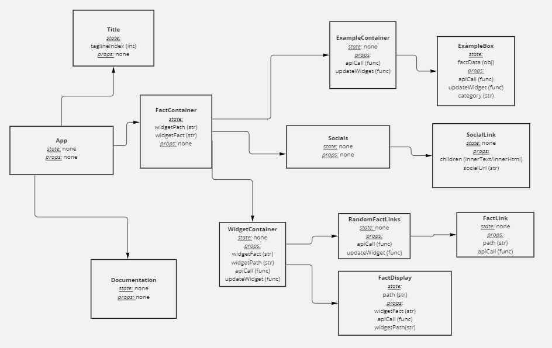

## NumbersApiMobile

Our mobile app interacts with the existing api that can be found at numbersapi.com. 

This whiteboard displays our planning process for the app's components. It indicates where the state and props live for each component as well as the hierarchy of components. 

Demo of app functionality. Displays clicking on api calls and receiving/displaying facts in the example boxes and widget container.  

.. image:: numbersApiMobileDemo1.gif
   :height: 50em
   
Displays api call using user input for the endpoint along with error handling for invalid endpoints. 

.. image:: numbersApiMobileDemo2.gif
   :height: 50em

# Technologies
React
React-Native
React-Native-Render-Html
Axios
MarkDown-It

